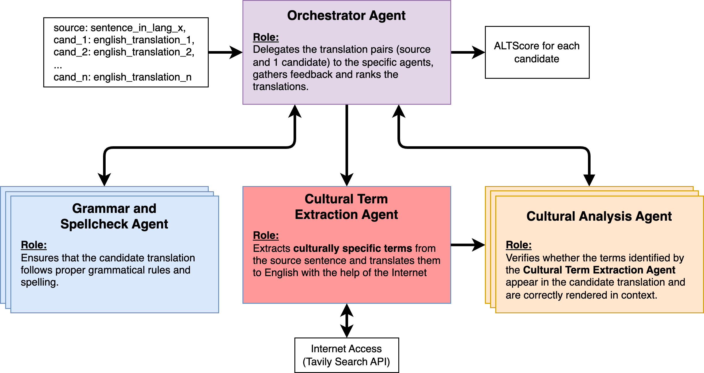

## 8903 Agentic LLMs

This code is for the paper "ALT-Bench".

## Workflow

ALT-Bench is a workflow for evaluating machine translations, which apart from simple translation evaluations, also measures the cultural and temporal contextual understanding of the translations. This then attempts to perform an informed benchmarking of the translation models, providing better clarity and a more holistic understanding of the translations.

## Running the main code
1. `pip install -r requirements.txt`
2. `python -m src.main`

## Generating translation data
1. `python -m datasets.scripts.generate_translations`